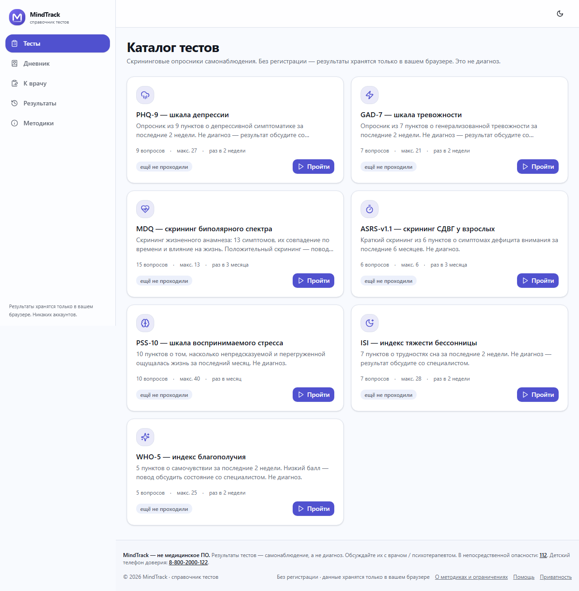
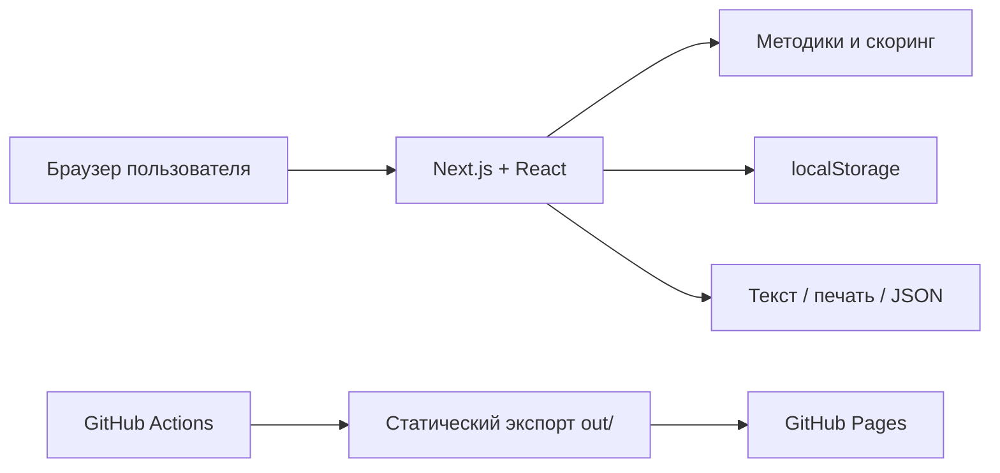

<div align="center">


# MindTrack

### Спокойный и приватный справочник скрининговых опросников

Самонаблюдение без регистрации и серверов: ответы обрабатываются в браузере, а история остаётся на вашем устройстве.

<p>
  <a href="https://simifar.github.io/mindtrack/"><strong>Открыть MindTrack →</strong></a>
  ·
  <a href="https://github.com/Simifar/mindtrack/issues">Сообщить об ошибке</a>
</p>

<p>
  <a href="https://github.com/Simifar/mindtrack/actions/workflows/ci.yml"></a>
  <a href="https://github.com/Simifar/mindtrack/actions/workflows/deploy.yml"></a>
  <a href="./LICENSE"></a>
  <a href="https://bun.sh/"></a>
</p>

</div>

<p align="center">
  
</p>

> ⚠️ **Важно:** MindTrack не является медицинским программным обеспечением, не ставит диагнозы и не заменяет консультацию специалиста. Результаты — только материал для самонаблюдения и разговора с врачом или психотерапевтом. В непосредственной опасности звоните **112**.

## Зачем MindTrack

Когда хочется внимательнее посмотреть на своё состояние, полезно начать с понятного инструмента, который не просит аккаунт и не отправляет личные ответы на сервер. MindTrack собирает в одном месте распространённые скрининговые методики и помогает подготовить результаты к обсуждению со специалистом.

| Что важно | Как это устроено |
| --- | --- |
| Приватность | Нет аккаунтов, backend, базы данных, cookie-сессий и аналитики ответов. |
| Понятный результат | Балл, интерпретация диапазона и ограничения методики показаны рядом. |
| Контроль данных | Историю можно удалить, экспортировать в JSON или сохранить как текст. |
| Спокойный интерфейс | Адаптивная светлая/тёмная тема, продолжение незавершённого опроса и мобильная навигация. |

## В каталоге

| Методика | О чём спрашивает | Пунктов | Период |
| --- | --- | ---: | --- |
| [PHQ-9](https://simifar.github.io/mindtrack/tests/phq-9/) | Симптомы депрессии | 9 | последние 2 недели |
| [GAD-7](https://simifar.github.io/mindtrack/tests/gad-7/) | Симптомы тревоги | 7 | последние 2 недели |
| [MDQ](https://simifar.github.io/mindtrack/tests/mdq/) | Признаки биполярного спектра | 13 + условия | жизненный опыт |
| [ASRS-v1.1](https://simifar.github.io/mindtrack/tests/asrs/) | Симптомы СДВГ у взрослых | 6 | последние 6 месяцев |
| [PSS-10](https://simifar.github.io/mindtrack/tests/pss-10/) | Воспринимаемый стресс | 10 | последний месяц |
| [ISI](https://simifar.github.io/mindtrack/tests/isi/) | Тяжесть бессонницы | 7 | последние 2 недели |
| [WHO-5](https://simifar.github.io/mindtrack/tests/who-5/) | Субъективное благополучие | 5 | последние 2 недели |

Названия методик, формулировки, пороги и источники отображаются в самом приложении. Русская версия не объявляется официальным переводом без подтверждения правообладателя.

## Возможности

- пройти любой опросник по отдельной ссылке и вернуться к незавершённому прохождению;
- посмотреть историю результатов, удалить её или импортировать JSON-бэкап;
- скопировать результат текстом, распечатать отчёт или скачать его;
- вести локальный дневник состояния и подготовить заметки к визиту к врачу;
- увидеть важные кризисные контакты с понятной подписью региона и возраста;
- пользоваться приложением с клавиатуры и на мобильном экране.

## Приватность по умолчанию

```text
ответы → подсчёт балла → результат
   └────────────── только в браузере
```

MindTrack — статический проект. В репозитории нет серверного API или базы данных, а данные приложения хранятся в `localStorage` текущего браузера. Очистка данных браузера удалит локальную историю; для переноса предусмотрен JSON-экспорт.

## Быстрый старт

Требуется [Bun](https://bun.sh/) версии `1.3.14` — она закреплена в `.bun-version`.

```bash
git clone https://github.com/Simifar/mindtrack.git
cd mindtrack
bun install --frozen-lockfile
bun run dev
```

Откройте <http://localhost:3000>.

### Проверки перед изменениями

```bash
bun run lint        # ESLint
bun run typecheck   # TypeScript
bun run test        # unit-тесты
bun run build       # статический экспорт в out/
bun run test:e2e    # browser smoke-тесты
```

Для E2E-тестов в отдельном терминале должен быть запущен `bun run dev`. CI дополнительно проверяет зависимости, размер статического бандла и сборку для GitHub Pages.

## Архитектура



- `src/data/tests.ts` — каталог методик, вопросы, варианты ответов и источники;
- `src/domain/tests/` — типы, валидация, форматирование и расчёт результатов;
- `src/lib/storage/` — локальное хранилище, миграции и безопасный импорт;
- `src/components/views/` — экраны каталога, прохождения, результатов, дневника и подготовки к визиту;
- `tests/` — unit- и browser-проверки критических пользовательских сценариев.

Проект собирается в обычный статический экспорт и не требует Node.js-сервера или отдельной инфраструктуры. Конфигурация GitHub Pages задаёт `PAGES_BASE_PATH` автоматически.

## Для участников

Перед Pull Request:

1. обсудите крупное изменение в [Issue](https://github.com/Simifar/mindtrack/issues);
2. сохраните принцип «локально и приватно» — не добавляйте отправку ответов на сервер без отдельного решения;
3. для изменений скоринга добавьте тесты граничных значений и ссылку на источник методики;
4. выполните проверки из раздела выше и опишите результат в PR.

Подробности: [CONTRIBUTING.md](./CONTRIBUTING.md), [SECURITY.md](./SECURITY.md) и [Code of Conduct](./CODE_OF_CONDUCT.md).

## Лицензия и ограничения

Код распространяется по лицензии [MIT](./LICENSE). Методики могут иметь собственные условия использования и лицензирования — источники и примечания указаны в приложении.

MindTrack не предназначен для диагностики, оценки непосредственного риска или самостоятельного выбора лечения. Если состояние ухудшается или вам небезопасно оставаться одному, обратитесь за срочной помощью и позвоните **112**.

<div align="center">

<sub>MindTrack · приватное самонаблюдение без регистрации</sub>

</div>
